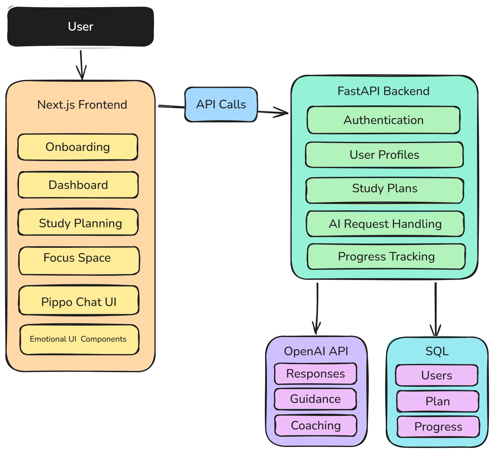
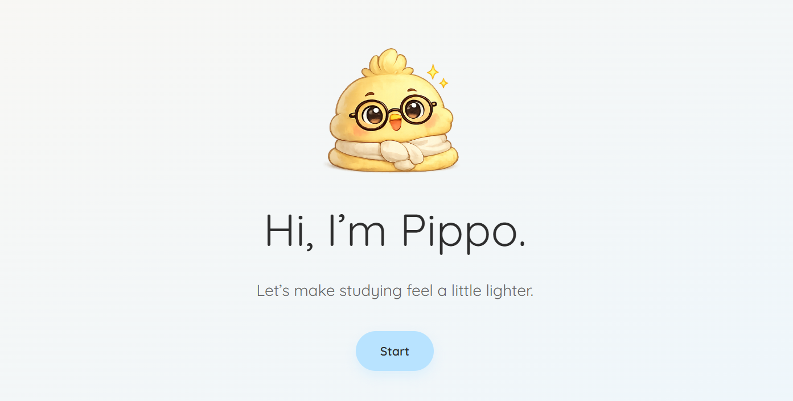
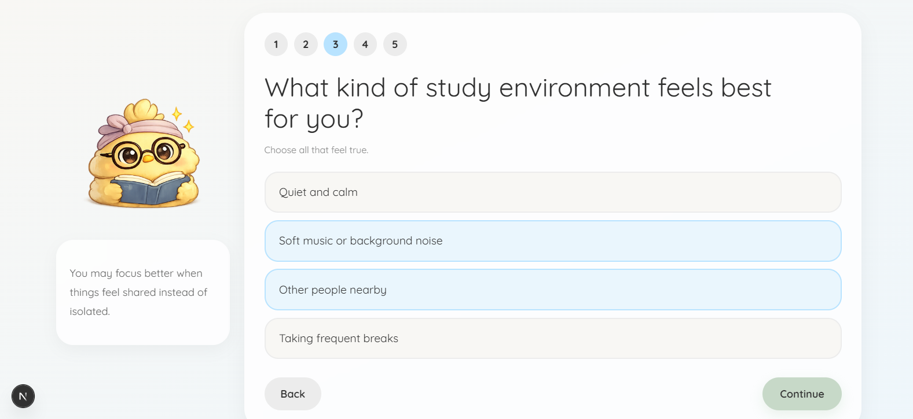
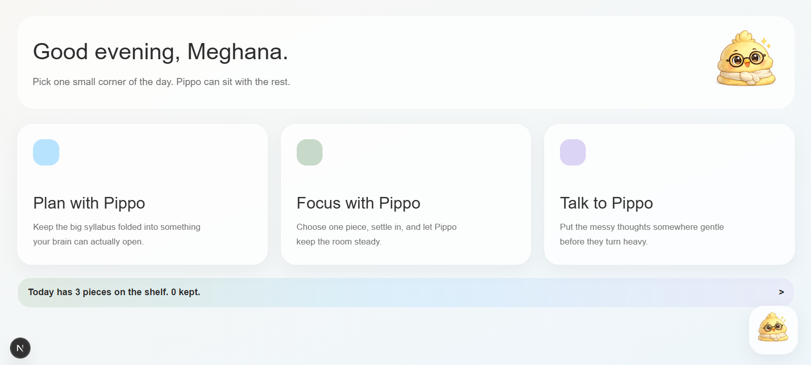
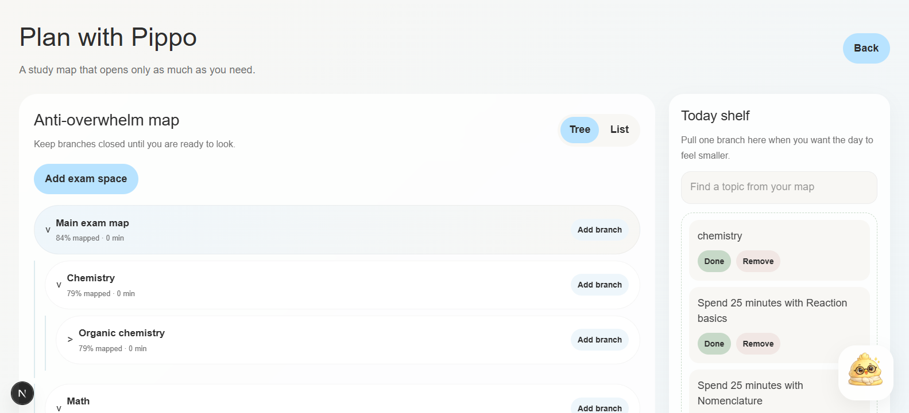
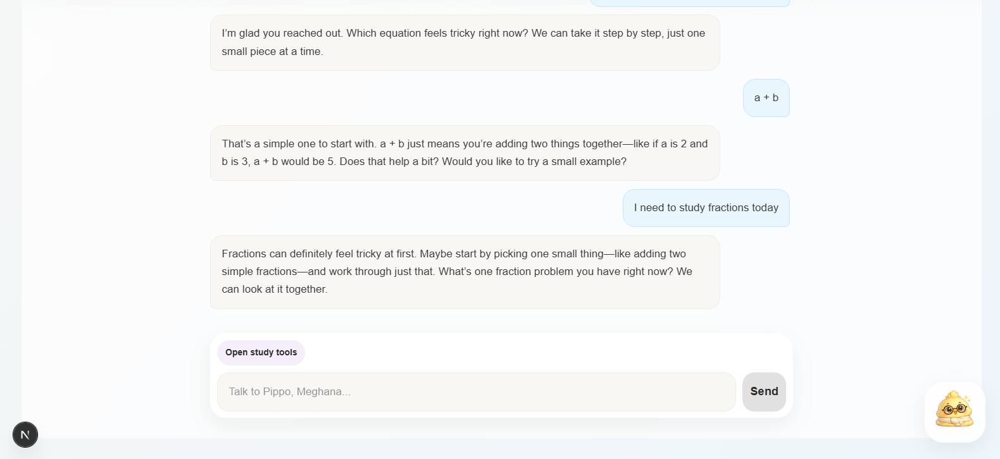
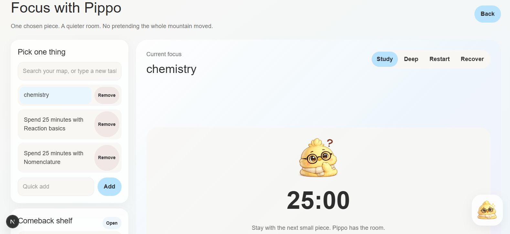

# Pippo.ai

Pippo.ai is an AI study companion focused on making studying feel less overwhelming and more personalized.

Instead of acting like a productivity app, the idea behind Pippo is to create a calmer and more emotionally aware studying experience that adapts to how different people actually work.

The onboarding flow is designed to understand things like:

* focus patterns
* motivation style
* study rhythm
* recovery habits
* pressure responses

Based on that, the experience can eventually adapt its tone, pacing, and support style over time.

## Built With

Frontend:

* Next.js
* React

Backend:

* FastAPI
* Python
* OpenAI API

## Architecture



## Current Features

* Multi-step onboarding flow
* Personalized onboarding questions
* Emotion-based Pippo reactions
* Sticky mascot sidebar
* Cozy UI system
* Dashboard workspace structure
* AI chat interface concepts
* Study planning workspace
<h2>Screenshots</h2>

<h3>Onboarding</h3>


<h3>Study Profile Setup</h3>


<h3>Dashboard</h3>


<h3>Plan With Pippo</h3>


<h3>Chat Interface</h3>


<h3>Focus Space</h3>



## Running Locally

Frontend:

```bash
cd frontend
npm install
npm run dev
```

Backend:

```bash
cd backend
uvicorn main:app --reload
```

## Notes

This project is still actively being improved.

Some things planned next:

* adaptive study plans
* memory system
* better animations
* emotional progress tracking
* improved mobile responsiveness

## Author

Built by Meghana Kasula.
